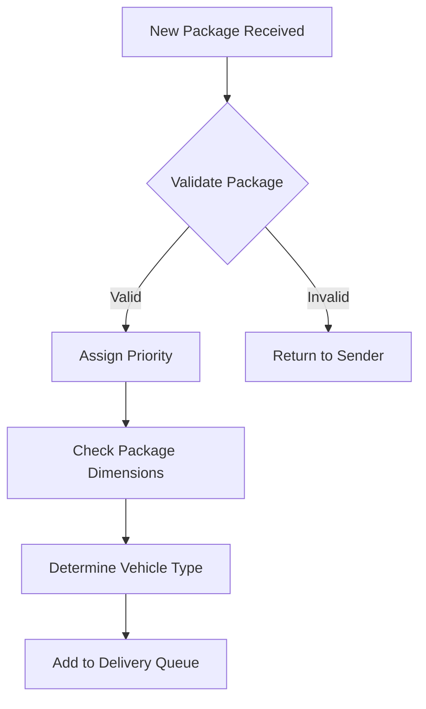
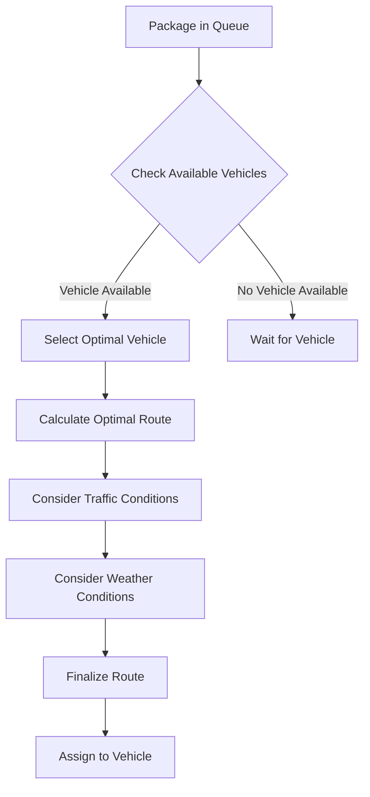
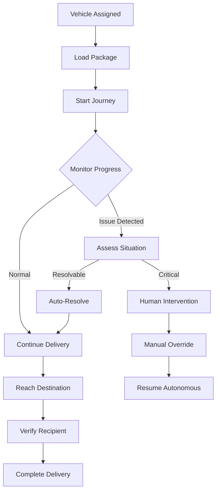
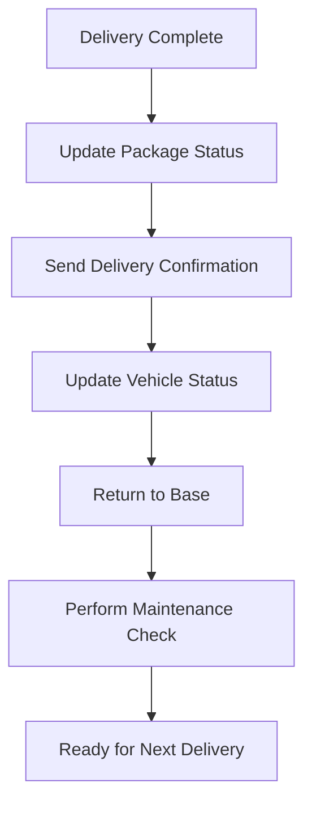
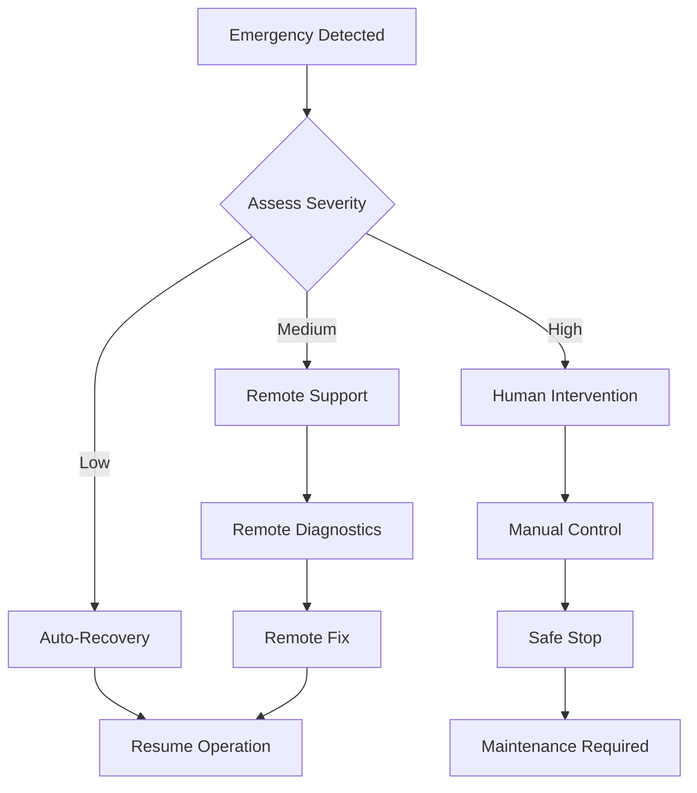
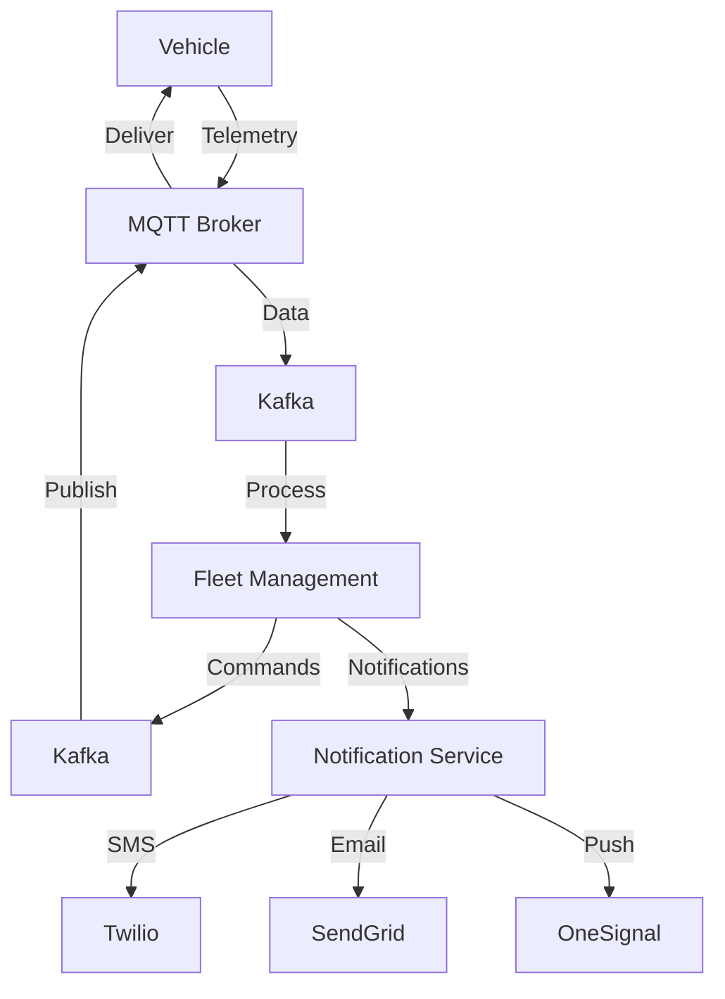
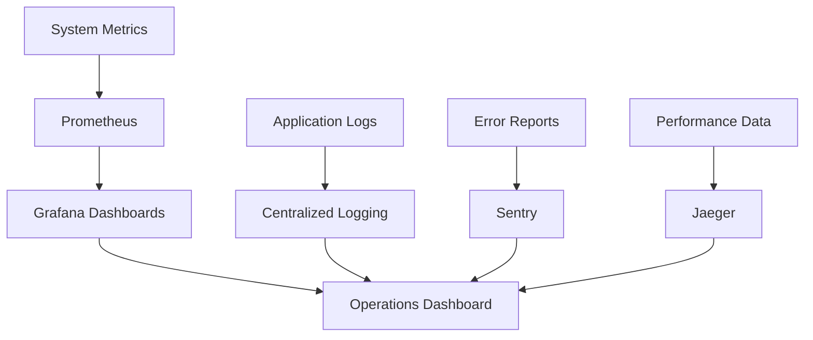
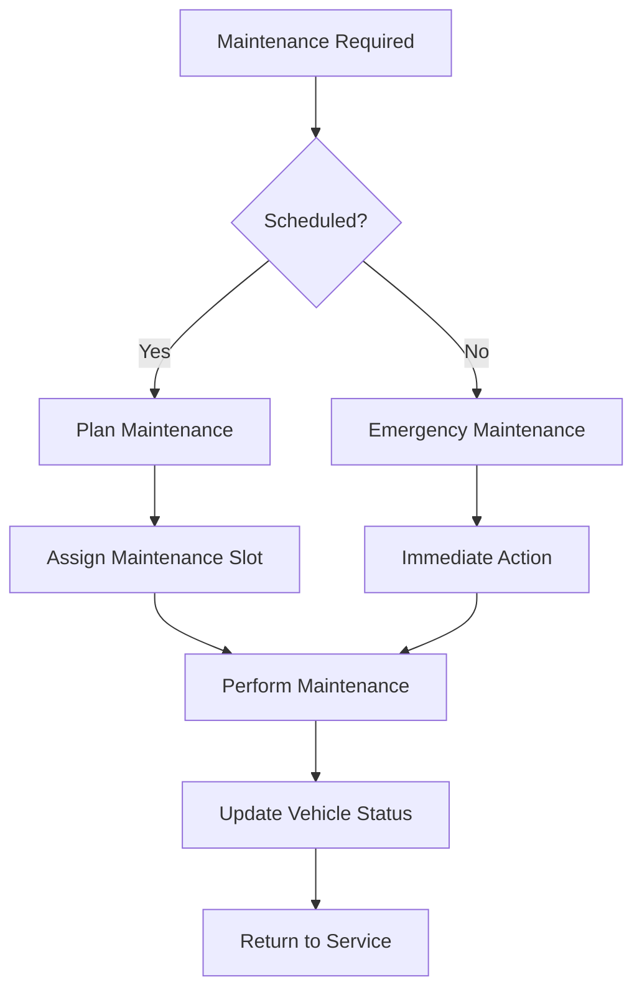
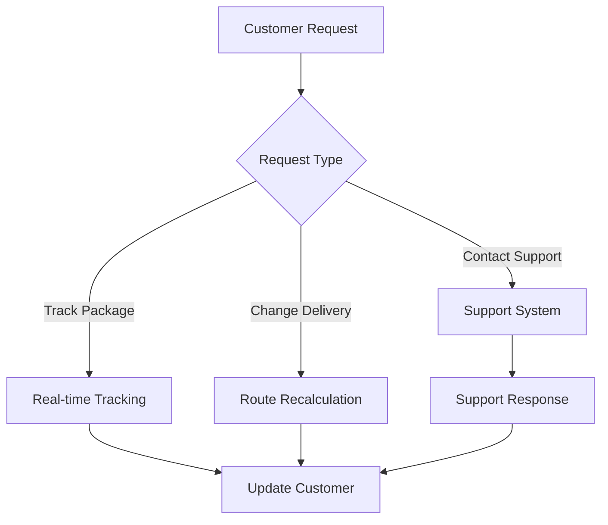
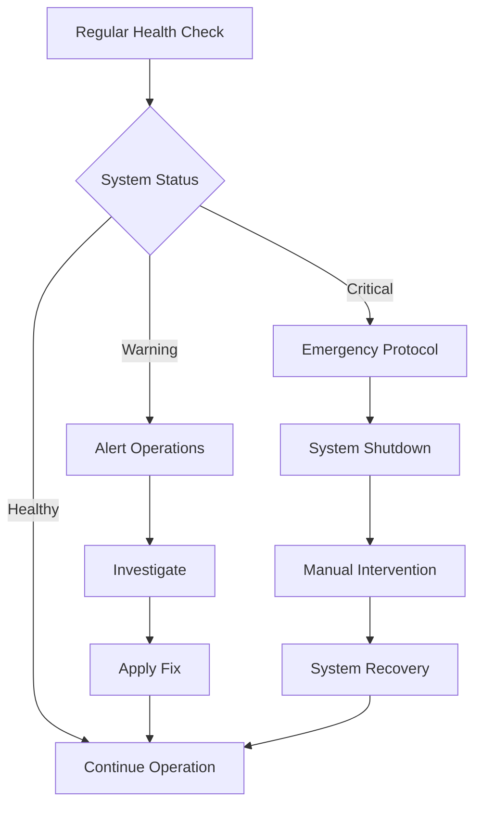

# Package Delivery Process Flow

## 1. Package Identification and Assignment

## 2. Vehicle Assignment and Route Planning

## 3. Delivery Execution

## 4. Post-Delivery Process

## 5. Emergency Protocol

## 6. Communication Flow

## 7. Monitoring and Analytics

## 8. Maintenance Workflow

## 9. Customer Interaction

## 10. System Health Check

