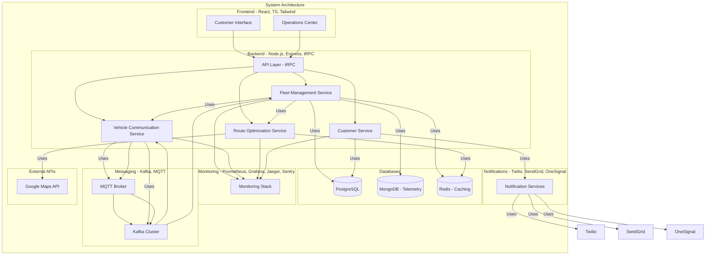

# High-Level Design (HLD) - Autonomous Delivery Fleet System

## HLD Architecture Diagram



## 1. System Overview

The autonomous delivery fleet system is designed as a distributed, scalable, and fault-tolerant architecture that manages self-driving vehicles for package delivery. The system is built using microservices architecture to ensure high availability and scalability.

## 2. Core Components

### 2.1 Fleet Management Service

- **Purpose**: Manages the entire fleet of autonomous vehicles
- **Key Features**:
  - Vehicle registration and tracking
  - Route optimization
  - Maintenance scheduling
  - Real-time status monitoring
- **Technologies**: Node.js, Express, PostgreSQL

### 2.2 Vehicle Communication Service

- **Purpose**: Handles all vehicle-to-cloud communication
- **Key Features**:
  - Real-time telemetry data collection
  - OTA updates distribution
  - Remote diagnostics
  - Emergency protocols
- **Technologies**: MQTT, Kafka, Node.js

### 2.3 Route Optimization Service

- **Purpose**: Optimizes delivery routes based on multiple factors
- **Key Features**:
  - Real-time traffic integration
  - Weather conditions consideration
  - Package priority handling
  - Dynamic route updates
- **Technologies**: Node.js, Google Maps API, Redis

### 2.4 Customer Service

- **Purpose**: Manages customer interactions and notifications
- **Key Features**:
  - Delivery tracking
  - Notification management
  - Customer preferences
  - Feedback collection
- **Technologies**: React, TypeScript, Twilio, SendGrid

### 2.5 Operations Center

- **Purpose**: Provides real-time monitoring and control
- **Key Features**:
  - Dashboard for fleet status
  - Incident management
  - Performance analytics
  - Human intervention coordination
- **Technologies**: React, Grafana, Prometheus

## 3. Data Flow

1. **Package Assignment Flow**:

   ```
   Customer Order → Route Optimization → Vehicle Assignment → Delivery Execution
   ```

2. **Vehicle Communication Flow**:

   ```
   Vehicle Telemetry → MQTT → Kafka → Processing → Storage/Analytics
   ```

3. **Notification Flow**:
   ```
   Event Trigger → Notification Service → Multiple Channels (SMS/Email/Push)
   ```

## 4. Security Architecture

### 4.1 Authentication & Authorization

- JWT-based authentication
- Role-based access control
- API key management for vehicle communication

### 4.2 Data Security

- End-to-end encryption for vehicle communication
- Secure storage of sensitive data
- Regular security audits

## 5. Scalability & Performance

### 5.1 Horizontal Scaling

- Microservices architecture
- Container orchestration with Kubernetes
- Load balancing across services

### 5.2 Performance Optimization

- Caching with Redis
- Message queuing with Kafka
- CDN for static content

## 6. Monitoring & Observability

### 6.1 Metrics Collection

- Prometheus for metrics
- Grafana for visualization
- Custom dashboards for different stakeholders

### 6.2 Logging & Tracing

- Distributed tracing with Jaeger
- Centralized logging
- Error tracking with Sentry

## 7. Disaster Recovery

### 7.1 Backup Strategy

- Regular database backups
- Multi-region deployment
- Failover mechanisms

### 7.2 Emergency Protocols

- Manual override capabilities
- Emergency contact system
- Incident response procedures

## 8. Integration Points

### 8.1 External Services

- Google Maps API
- Weather services
- Traffic data providers
- Payment gateways

### 8.2 Internal Systems

- Order management system
- Inventory management
- Customer relationship management
- Analytics platform

## 9. Ethical & Legal Compliance

### 9.1 Safety Measures

- Redundant systems
- Fail-safe mechanisms
- Regular safety audits

### 9.2 Privacy & Data Protection

- GDPR compliance
- Data minimization
- Privacy by design

## 10. Future Considerations

### 10.1 Scalability

- Support for increased fleet size
- Geographic expansion
- New vehicle types

### 10.2 Innovation

- AI/ML integration
- Advanced route optimization
- Enhanced safety features
