# Low-Level Design (LLD) - Autonomous Delivery Fleet System

## System Architecture Diagram

```mermaid
graph TB
    subgraph "Autonomous Delivery Fleet System"
        subgraph "Frontend Layer"
            UI[Customer Interface]
            OPS[Operations Center]
            DASH[Monitoring Dashboard]
        end

        subgraph "API Layer"
            TRPC[tRPC API Gateway]
            AUTH[Authentication Service]
        end

        subgraph "Service Layer"
            FMS[Fleet Management Service]
            VCS[Vehicle Communication Service]
            ROS[Route Optimization Service]
            CS[Customer Service]
        end

        subgraph "Data Layer"
            PG[(PostgreSQL)]
            MONGO[(MongoDB)]
            REDIS[(Redis)]
        end

        subgraph "Message Layer"
            MQTT[MQTT Broker]
            KAFKA[Kafka Cluster]
        end

        subgraph "Monitoring Layer"
            PROM[Prometheus]
            GRAF[Grafana]
            JAEG[Jaeger]
            SENT[Sentry]
        end
    end

    UI --> TRPC
    OPS --> TRPC
    DASH --> TRPC
    TRPC --> AUTH
    AUTH --> FMS
    AUTH --> VCS
    AUTH --> ROS
    AUTH --> CS

    FMS --> PG
    FMS --> MONGO
    FMS --> REDIS
    VCS --> MQTT
    VCS --> KAFKA
    ROS --> REDIS
    CS --> PG

    MQTT --> KAFKA
    KAFKA --> FMS

    FMS --> PROM
    FMS --> JAEG
    FMS --> SENT
    PROM --> GRAF

    subgraph "Database Schema"
        subgraph "VEHICLES"
            V1[id: UUID]
            V2[vehicle_number: VARCHAR]
            V3[status: VARCHAR]
            V4[current_location: POINT]
            V5[battery_level: FLOAT]
            V6[last_maintenance_date: TIMESTAMP]
            V7[created_at: TIMESTAMP]
        end

        subgraph "ROUTES"
            R1[id: UUID]
            R2[vehicle_id: UUID]
            R3[start_location: POINT]
            R4[end_location: POINT]
            R5[status: VARCHAR]
            R6[created_at: TIMESTAMP]
        end

        subgraph "PACKAGES"
            P1[id: UUID]
            P2[route_id: UUID]
            P3[customer_id: UUID]
            P4[status: VARCHAR]
            P5[priority: INTEGER]
            P6[created_at: TIMESTAMP]
        end
    end

    subgraph "Communication Flow"
        V[Vehicle] -->|Telemetry| M[MQTT Broker]
        M -->|Data| K[Kafka]
        K -->|Process| F[Fleet Management]
        F -->|Commands| K
        K -->|Publish| M
        M -->|Deliver| V
    end

    subgraph "Security Layer"
        JWT[JWT Auth]
        RBAC[Role Based Access]
        E2E[End-to-End Encryption]
    end

    subgraph "Monitoring Stack"
        PROM2[Prometheus]
        GRAF2[Grafana]
        JAEG2[Jaeger]
        SENT2[Sentry]
    end

    subgraph "Kubernetes Deployment"
        subgraph "Fleet Management Pod"
            FMS2[Fleet Management Service]
            FMS_DB[(PostgreSQL)]
        end

        subgraph "Vehicle Communication Pod"
            VCS2[Vehicle Communication Service]
            MQTT2[MQTT Broker]
        end

        subgraph "Route Optimization Pod"
            ROS2[Route Optimization Service]
            REDIS2[(Redis)]
        end

        subgraph "Monitoring Pod"
            PROM3[Prometheus]
            GRAF3[Grafana]
            JAEG3[Jaeger]
        end
    end

    FMS2 --> FMS_DB
    VCS2 --> MQTT2
    ROS2 --> REDIS2
    FMS2 --> PROM3
    VCS2 --> PROM3
    ROS2 --> PROM3
```



## 1. Service Implementation Details

### 1.1 Fleet Management Service

#### Database Schema (PostgreSQL)

```sql
-- Vehicles Table
CREATE TABLE vehicles (
    id UUID PRIMARY KEY,
    vehicle_number VARCHAR(50) UNIQUE,
    status VARCHAR(20),
    current_location POINT,
    battery_level FLOAT,
    last_maintenance_date TIMESTAMP,
    created_at TIMESTAMP DEFAULT CURRENT_TIMESTAMP
);

-- Routes Table
CREATE TABLE routes (
    id UUID PRIMARY KEY,
    vehicle_id UUID REFERENCES vehicles(id),
    start_location POINT,
    end_location POINT,
    status VARCHAR(20),
    created_at TIMESTAMP DEFAULT CURRENT_TIMESTAMP
);

-- Packages Table
CREATE TABLE packages (
    id UUID PRIMARY KEY,
    route_id UUID REFERENCES routes(id),
    customer_id UUID,
    status VARCHAR(20),
    priority INTEGER,
    created_at TIMESTAMP DEFAULT CURRENT_TIMESTAMP
);
```

#### API Endpoints (tRPC)

```typescript
// Vehicle Management
const vehicleRouter = router({
  register: publicProcedure
    .input(
      z.object({
        vehicleNumber: z.string(),
        initialLocation: z.object({
          lat: z.number(),
          lng: z.number(),
        }),
      })
    )
    .mutation(async ({ input }) => {
      // Implementation
    }),

  updateStatus: publicProcedure
    .input(
      z.object({
        vehicleId: z.string().uuid(),
        status: z.enum(["IDLE", "ACTIVE", "MAINTENANCE", "EMERGENCY"]),
      })
    )
    .mutation(async ({ input }) => {
      // Implementation
    }),
});

// Route Management
const routeRouter = router({
  create: publicProcedure
    .input(
      z.object({
        vehicleId: z.string().uuid(),
        packages: z.array(z.string().uuid()),
      })
    )
    .mutation(async ({ input }) => {
      // Implementation
    }),
});
```

### 1.2 Vehicle Communication Service

#### MQTT Topics Structure

```
vehicles/
  ├── {vehicle_id}/
  │   ├── telemetry/
  │   │   ├── location
  │   │   ├── battery
  │   │   ├── speed
  │   │   └── diagnostics
  │   ├── commands/
  │   │   ├── update
  │   │   ├── emergency
  │   │   └── maintenance
  │   └── status/
  │       ├── online
  │       └── offline
```

#### Kafka Topics

```
vehicle-telemetry
vehicle-commands
vehicle-events
maintenance-alerts
emergency-alerts
```

### 1.3 Route Optimization Service

#### Algorithm Components

```typescript
interface RouteOptimizationParams {
  packages: Package[];
  vehicles: Vehicle[];
  trafficData: TrafficData;
  weatherData: WeatherData;
}

class RouteOptimizer {
  async optimizeRoute(params: RouteOptimizationParams): Promise<Route> {
    // Implementation using Google Maps API
  }

  async updateRoute(
    routeId: string,
    newConditions: RouteConditions
  ): Promise<Route> {
    // Dynamic route updates
  }
}
```

### 1.4 Customer Service

#### Notification System

```typescript
interface NotificationConfig {
  channels: {
    sms: boolean;
    email: boolean;
    push: boolean;
  };
  preferences: {
    language: string;
    quietHours: {
      start: string;
      end: string;
    };
  };
}

class NotificationService {
  async sendNotification(
    userId: string,
    type: NotificationType,
    data: NotificationData
  ): Promise<void> {
    // Implementation using Twilio, SendGrid, and OneSignal
  }
}
```

## 2. Data Models

### 2.1 Vehicle Model

```typescript
interface Vehicle {
  id: string;
  vehicleNumber: string;
  status: VehicleStatus;
  location: {
    lat: number;
    lng: number;
  };
  batteryLevel: number;
  lastMaintenance: Date;
  currentRoute?: Route;
  telemetry: {
    speed: number;
    temperature: number;
    diagnostics: VehicleDiagnostics;
  };
}
```

### 2.2 Package Model

```typescript
interface Package {
  id: string;
  customerId: string;
  status: PackageStatus;
  priority: number;
  dimensions: {
    length: number;
    width: number;
    height: number;
    weight: number;
  };
  deliveryAddress: Address;
  specialInstructions?: string;
}
```

## 3. Security Implementation

### 3.1 Authentication Middleware

```typescript
const authMiddleware = t.middleware(async ({ ctx, next }) => {
  const token = ctx.req.headers.authorization?.split(" ")[1];
  if (!token) {
    throw new TRPCError({ code: "UNAUTHORIZED" });
  }

  const decoded = jwt.verify(token, process.env.JWT_SECRET);
  return next({
    ctx: {
      ...ctx,
      user: decoded,
    },
  });
});
```

### 3.2 Vehicle Communication Security

```typescript
class VehicleCommunication {
  private encryptMessage(message: any): string {
    // Implementation using AES-256
  }

  private decryptMessage(encryptedMessage: string): any {
    // Implementation using AES-256
  }
}
```

## 4. Monitoring Implementation

### 4.1 Prometheus Metrics

```typescript
const vehicleMetrics = new Prometheus.Counter({
  name: "vehicle_operations_total",
  help: "Total number of vehicle operations",
  labelNames: ["operation_type", "vehicle_id"],
});

const routeMetrics = new Prometheus.Histogram({
  name: "route_duration_seconds",
  help: "Duration of routes in seconds",
  labelNames: ["route_id"],
});
```

### 4.2 Jaeger Tracing

```typescript
const tracer = new Jaeger.Tracer({
  serviceName: "fleet-management",
  sampler: new Jaeger.ConstSampler(true),
  reporter: new Jaeger.RemoteReporter(),
});

const traceMiddleware = t.middleware(async ({ ctx, next }) => {
  const span = tracer.startSpan("request");
  try {
    return await next();
  } finally {
    span.finish();
  }
});
```

## 5. Error Handling

### 5.1 Global Error Handler

```typescript
const errorHandler = (error: Error) => {
  if (error instanceof TRPCError) {
    // Handle tRPC errors
  } else if (error instanceof DatabaseError) {
    // Handle database errors
  } else {
    // Handle unexpected errors
    Sentry.captureException(error);
  }
};
```

### 5.2 Vehicle Error Recovery

```typescript
class VehicleErrorRecovery {
  async handleError(vehicleId: string, error: VehicleError): Promise<void> {
    // Implementation of error recovery procedures
  }

  async initiateEmergencyProtocol(vehicleId: string): Promise<void> {
    // Implementation of emergency protocols
  }
}
```

## 6. Testing Strategy

### 6.1 Unit Tests

```typescript
describe("RouteOptimizer", () => {
  it("should optimize route based on traffic conditions", async () => {
    // Test implementation
  });

  it("should handle emergency situations", async () => {
    // Test implementation
  });
});
```

### 6.2 Integration Tests

```typescript
describe("Vehicle Communication", () => {
  it("should handle real-time telemetry data", async () => {
    // Test implementation
  });

  it("should process commands correctly", async () => {
    // Test implementation
  });
});
```

## 7. Deployment Configuration

### 7.1 Docker Configuration

```dockerfile
# Base image
FROM node:16-alpine

# Set working directory
WORKDIR /app

# Copy package files
COPY package*.json ./

# Install dependencies
RUN npm install

# Copy source code
COPY . .

# Build application
RUN npm run build

# Expose port
EXPOSE 3000

# Start application
CMD ["npm", "start"]
```

### 7.2 Kubernetes Configuration

```yaml
apiVersion: apps/v1
kind: Deployment
metadata:
  name: fleet-management
spec:
  replicas: 3
  selector:
    matchLabels:
      app: fleet-management
  template:
    metadata:
      labels:
        app: fleet-management
    spec:
      containers:
        - name: fleet-management
          image: fleet-management:latest
          ports:
            - containerPort: 3000
          env:
            - name: DATABASE_URL
              valueFrom:
                secretKeyRef:
                  name: db-secrets
                  key: url
```
